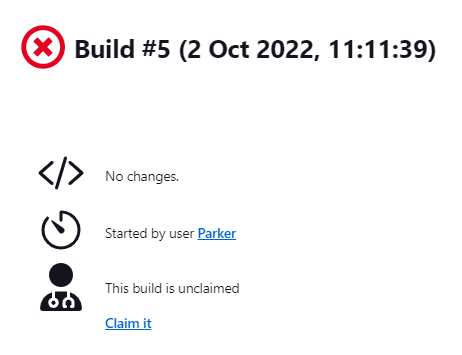
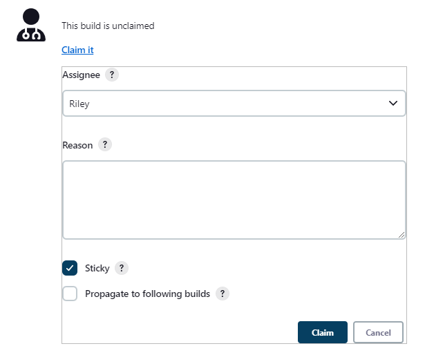
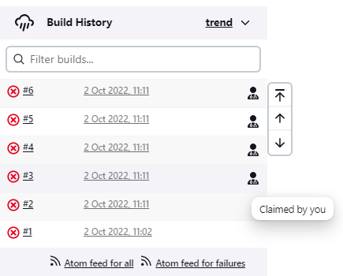
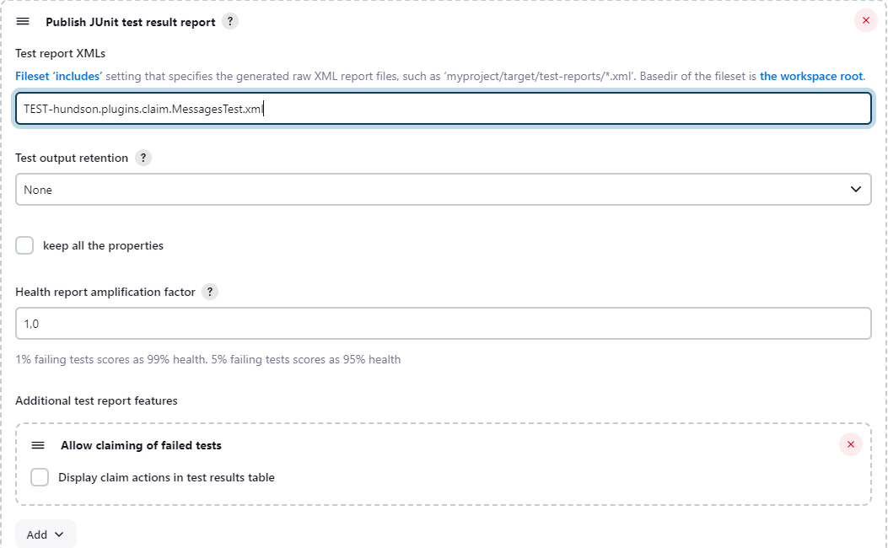
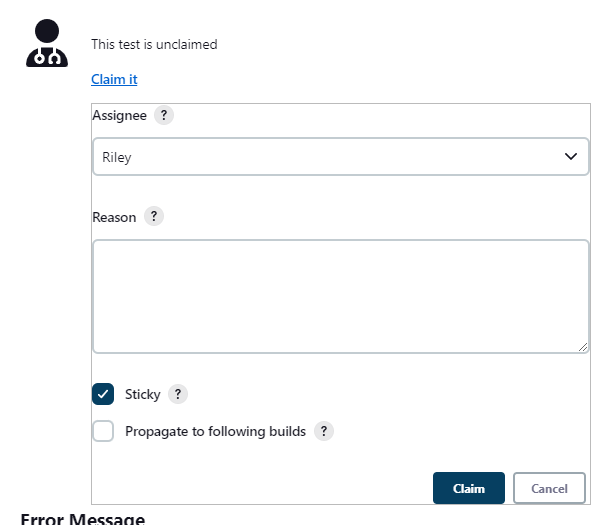
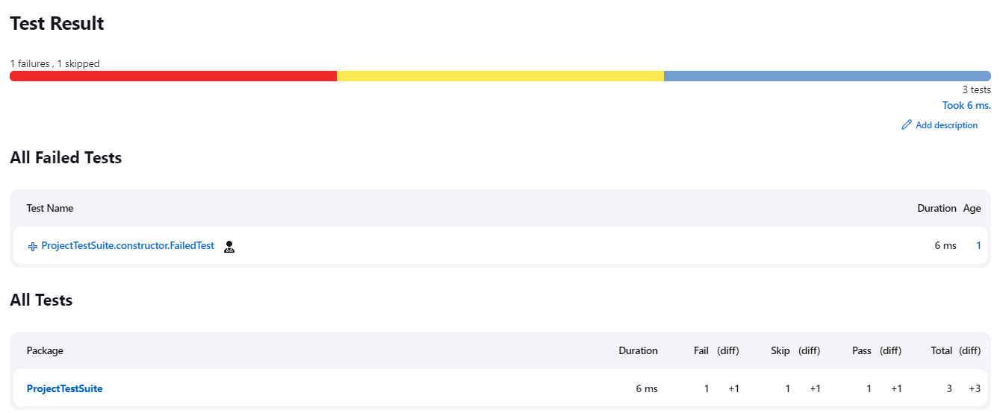
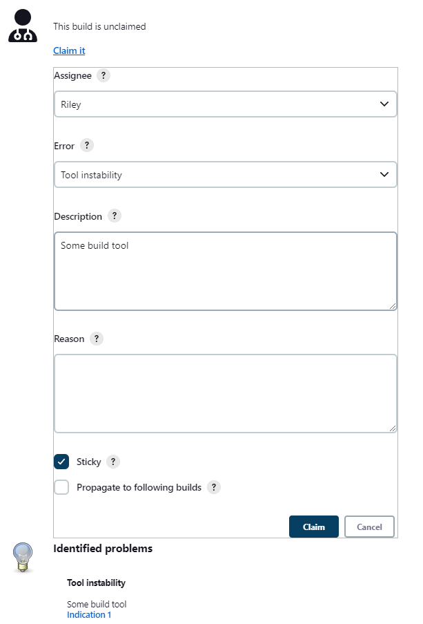

Claim plugin
====================

## About this plugin

The Nuget plugin is meant to allow users to claim failing builds and tests from [Jenkins](https://jenkins.io) to signal they are taking responsibility in fixing them.

Supported features

* Claiming **failed builds**.
* Claiming **failed tests**.
* Marking claims as **sticky**, so that future failing builds or tests will keep the declared claim
* Ensuring claim **propagate to following builds**, if claim is not done on the last build
* Running a **Groovy script** on claim
* Integrating with [Build Failure Analyzer plugin] to **describe claims using BFA knowledge base**
* Integrating with [Mailer plugin] to **notify claims by mail**

## Usage

### Installing and enabling the plugin

The Claim plugin can be installed from any Jenkins installation connected to the Internet using the **Plugin Manager** screen.

You can then access the **Manage Jenkins** > **Configure System** > **Claim** section to configure global settings and default options for the plugin.

### Allow claiming of failed builds

To allow claiming of failed builds, add a **Allow broken build claiming** post-build action to your project.

### Claiming a build

Steps | Screenshot
----- | ----------
Failed builds will then display a **Claim it** option. | 
Upon clicking the **Claim it** link, a logged-in user can then claim the build. | 
The build will then display the claim information, along with options to **Drop the claim** or **Reassign it**. | 
The claim information will also be displayed on the **Build History** widget, with information about the claim. | 

### Allow claiming of failed tests

To allow claiming of failed tests, add a **Allow claiming of failed test** additional test report features to your test results report post-build action.

### Claiming a test

Steps | Screenshot
----- | ----------
Failed tests will then display a **Claim it** option. | 
Upon clicking the **Claim it** link, a logged-in user can then claim the test. | 
The test will then display the claim information, along with options to **Drop the claim** or **Reassign it**. | 
The claim information will also be displayed on the **Test Result** page, with a tooltipinformation about the claim. | 

### Integration with Build Failure Analuzer
This feature is supported from v2.8 forward.

Given the [Build Failure Analyzer plugin] is installed and eblaed, users can use failure causes stored in the BFA plugin knowledge base to describe their claim, and this cause will be stored with the claimed build or test.

To claim a build with a failure cause:

Upon claiming the build, the "Error" drop-down will be populated with all failure causes defined in the knowledge base.
Selecting a failure cause will update the "Description" field with the cause description
By default, selecting "None" will result in the default claim plugin behaviour.
If there are already failure causes automatically detected by BFA, the claimed cause will be added to the list of identified problems.
Claiming without a failure cause selected will result in no additional causes specified under "Identified Problems"
The user may also input a claim reason, which is saved in the claim report as per default functionality.

### Limitations
As the plugin uses a post build action to allow claiming, build or tests marked as failed priori to enabling the plugin will not have any claim action proposed.

## License

[MIT License](./LICENSE.md)

## More information

[Changelog](./CHANGELOG.md)

[Build Failure Analyzer plugin]: https://plugins.jenkins.io/build-failure-analyzer
[Mailer plugin]: https://plugins.jenkins.io/mailer
